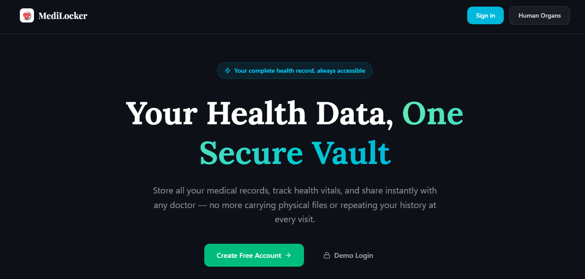
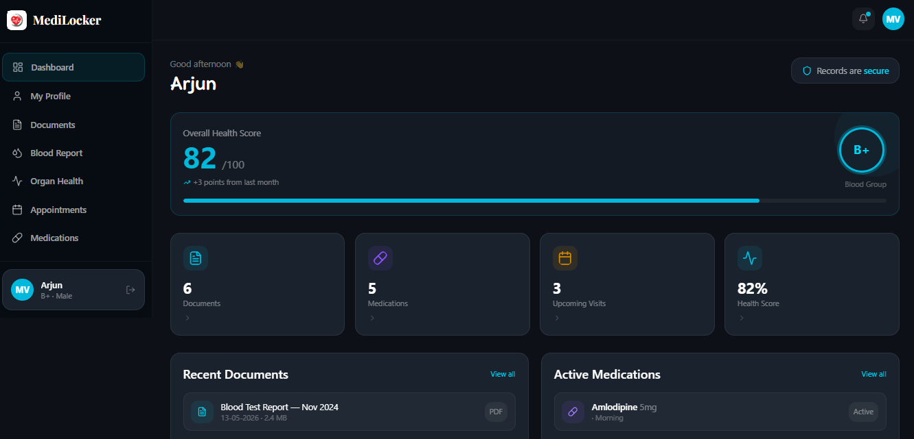

# 🏥 MediLocker

> A modern and secure healthcare management dashboard built with React, Tailwind CSS, and interactive UI components.



---

## ✨ Overview

MediLocker helps users manage and track their healthcare records in one place.  
The platform provides an elegant dashboard for monitoring health data, appointments, medications, documents, and organ health information.

---

## 🚀 Features

### 📄 Smart Document Management
- Upload and manage prescriptions, reports, and medical documents
- Organized document dashboard
- Easy access to records

### 💊 Medication Tracking
- View active medications
- Track dosage and schedules
- Medicine reminders interface

### 📅 Appointment Management
- Add new appointments dynamically
- Upcoming & completed appointment tracking
- Interactive appointment cards

### ❤️ Organ Health Information
- Learn about important body organs
- Educational health content
- Interactive organ cards

### 📊 Health Dashboard
- Overall health score
- Blood group display
- Recent records and activity monitoring


---

## 🖼️ Project Preview

### Dashboard UI



---

## 🛠️ Tech Stack

| Technology | Usage |
|------------|-------|
| React.js | Frontend Framework |
| Tailwind CSS | Styling |
| recharts | Charts |
| Lucide React | Icons |
| React Router DOM | Routing |
| Vite | Development Environment |

---


---

## ⚙️ Installation

Clone the repository:

```bash
git clone https://github.com/your-username/medilocker.git
```

Move into project folder:

```bash
cd medilocker
```

Install dependencies:

```bash
npm install
```

Run the development server:

```bash
npm run dev
```

---

## 📱 Responsive Design

MediLocker is fully responsive and optimized for:

- 💻 Desktop
- 📱 Mobile
- 📟 Tablet

---

## 🌟 Future Improvements

- User Authentication
- Backend Integration
- Cloud Storage
- AI Health Assistant
- Real-time Notifications
- Dark/Light Theme Toggle

---

## 👨‍💻 Author

### Vishal Kumar Soni

- GitHub: https://github.com/vishalkumar2024
- LinkedIn: https://www.linkedin.com/in/vishal-kumar-soni-/

---

## 📜 License

This project is licensed under the MIT License.

---

# ⭐ If you like this project, give it a star on GitHub!